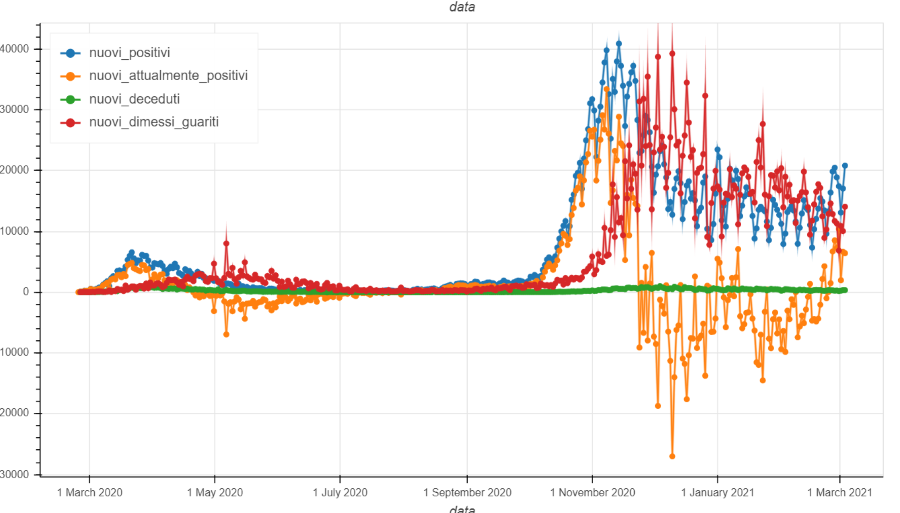

.. Covid-19-dashboard documentation master file, created by
   sphinx-quickstart on Wed Mar  3 19:08:53 2021.
   You can adapt this file completely to your liking, but it should at least
   contain the root `toctree` directive.

Welcome to Covid-19-dashboard's documentation!
==============================================

.. toctree::
   :hidden:
   :maxdepth: 2
   :caption: Contents:

   Pagine_di_prova/nuovapagina
   Pagine_di_prova/secondaPagina
   Tutto ciò che serve <covid_19.rst>

Indices and tables
==================

* :ref:`genindex`
* :ref:`modindex`

Output
=====================
The dashboard shows six graphs regarding the COVID-19 situation. Below is a brief summary of what is reported. (The graphs are numbered from left to right, top to bottom)

#. It represents the number of swabs carried out and how many of these were positive.
#. Shows the cumulative situation of currently positive, deceased and discharged healed.
#. It represents the daily changes of **graph 2**
#. The graph plots the rate of new positive swabs, new positives, mortality and recovery rates
#. It shows the daily breakdown between patients in home isolation, hospitalized and in intensive care.
#. Show the data rate in **graph 5**

As an example, we report a graph (dated March 4, 2021) of **type 3**.

.. note::  Data are taken automatically from `Protezione Civile <http://www.protezionecivile.gov.it/>`_

Video tutorial
===========

The graphs, made with Bokeh, have various features shown in the video below.

.. raw:: html

   

      <iframe width="560" height="315" src="https://www.youtube.com/embed/MapQ0BZF-RU" frameborder="0" allow="accelerometer; autoplay; clipboard-write; encrypted-media; gyroscope; picture-in-picture" allowfullscreen></iframe>
   
</>

:ref:`Cross-References to Locations in the Same Document`

